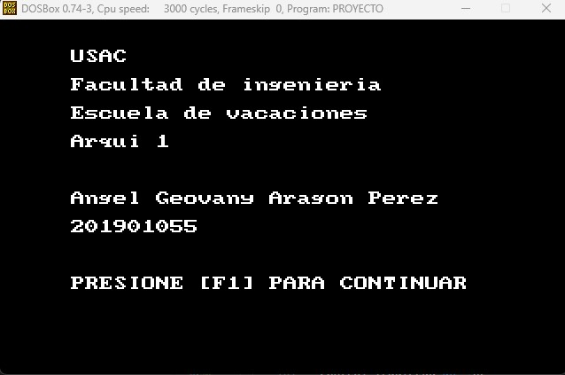
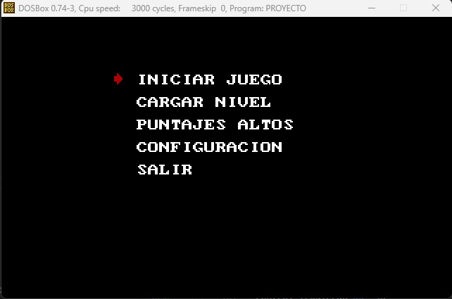
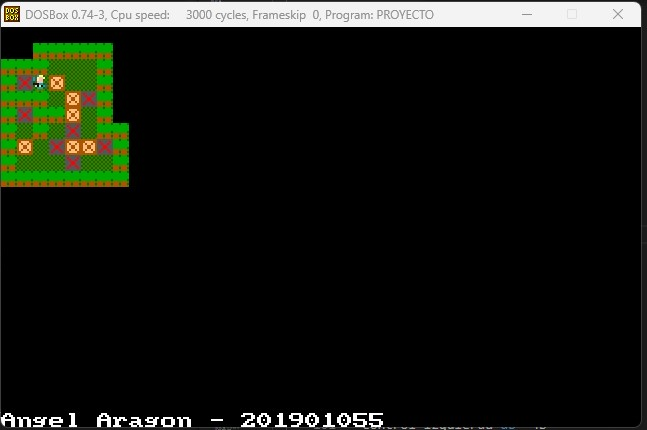
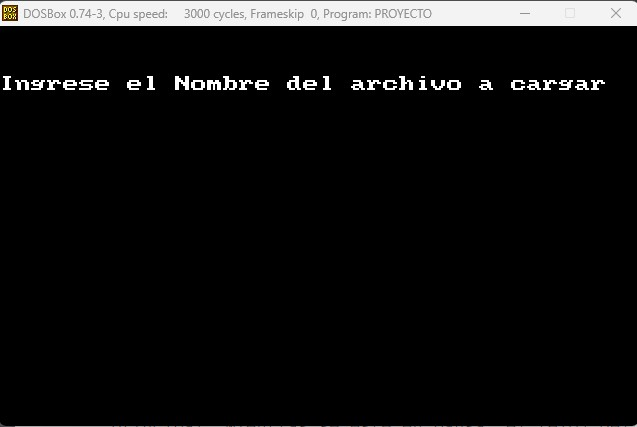
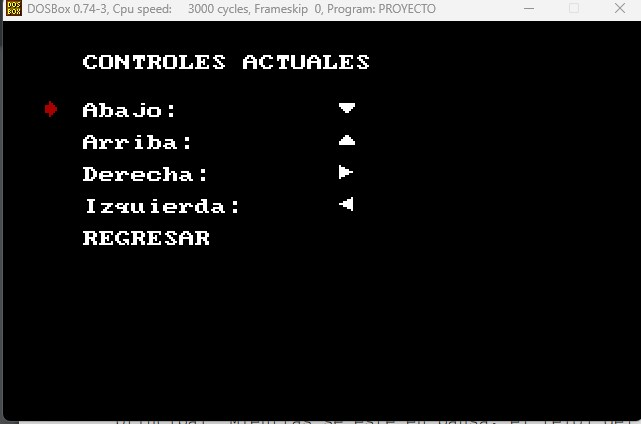

*Universidad de San Carlos de Guatemala*  
*Escuela de Ingeniería en Ciencias y Sistemas, Facultad de Ingenieria*  
*Arquitectura de Computadores y Ensambladores 1, 2023.*  

___
## **PROYECTO 2**
___
**Angel Geovany Aragón Pérez**  
**201901055**
___
## **MANUAL DE USUARIO**
___
##### ***Inicializacion del Programa***
Al iniciar el programa, se mostrará en la pantalla una interfaz inicial que proporcionará información sobre su creador. Para continuar, deberá presionar la tecla F1.



##### ***Menu Principal***
A continuación de la pantalla inicial, se le presentará en pantalla el menú principal, el cual puede ser navegado utilizando las teclas de flecha (arriba, abajo, derecha e izquierda). Una vez que se haya posicionado en la opción deseada, deberá presionar la tecla F1 para continuar.



##### ***Iniciar Juego***
Al seleccionar la opción "Iniciar juego" en el menú principal, se iniciará el juego en el nivel 1, el cual se mostrará en pantalla. Para poner el juego en pausa, deberá seleccionar la tecla F2.



##### ***Cargar Nivel***
Al seleccionar la opción "Cargar Nivel" en el menú principal, se solicitará al usuario que ingrese el nombre del archivo que contiene el nivel que desea cargar en el sistema. Una vez ingresado el nombre del archivo, se procederá a cargar el nivel y, posteriormente, iniciarlo.



##### ***Configuracion***
Al seleccionar la opción "Configuración" en el menú principal, se mostrarán en pantalla los controles actuales para el movimiento del personaje en el juego. Para modificar un control específico, podrá desplazarse utilizando las teclas de flecha (arriba, abajo, derecha, izquierda) y, una vez ubicado en la opción que desea modificar, deberá presionar la tecla F1. A continuación, se le pedirá que ingrese la nueva tecla que desea asignar para realizar ese movimiento en particular.



___
## **MANUAL Tecnico**
___

#### **SUBRUTINAS**

##### **cadena_numero**
```assembly
  cadena_numero:
		mov AL, 00    
		mov CX, 0002  
seguir_convirtiendo:
		mov BL, [DI]
		cmp BL, 00
		je retorno_cadenaAnum
		sub BL, 30    
		mov DL, 000a	
		mul DL        
		mov BH, 00
		add AL, BL
		inc DI       
		loop seguir_convirtiendo
retorno_cadenaAnum:
		ret
```
La siguiente subrutina tiene la responsabilidad de convertir una cadena en un número hexadecimal de un byte. Recibe como entrada el registro DI, donde se encuentra la dirección de la cadena almacenada, y su salida se encuentra en el registro AL con el número hexadecimal correspondiente.

##### **pintar_pixel**
```assembly
pintar_pixel:
    push AX
    push BX
    push CX
    push DX
    push DI
    push SI
    push DS
    mov DX, 0a000
    mov DS, DX
    mov SI, AX
    mov AX, 140
    mul BX
    add AX, SI
    mov DI, AX
    mov [DI], CL  ;; pintar
    pop DS
    pop SI
    pop DI
    pop DX
    pop CX
    pop BX
    pop AX
    ret
```
La siguiente subrutina se encarga de dibujar un píxel en la pantalla. Recibe los siguientes parámetros de entrada: AX para la posición en el eje X, BX para la posición en el eje Y y CL para el color con el cual se desea pintar el píxel.

##### **pintar_sprite**
```assembly
pintar_sprite:
    push DI
    push SI
    push AX
    push BX
    push CX
    inc SI
    mov DH, [SI]  
    dec SI     
inicio_pintar_fila:
    cmp DH, 00
    je fin_pintar_sprite
    push AX
    mov DL, [SI]
pintar_fila:
    cmp DL, 00
    je pintar_siguiente_fila
    mov CL, [DI]
    call pintar_pixel
    inc AX
    inc DI
    dec DL
    jmp pintar_fila
pintar_siguiente_fila:
    pop AX
    inc BX
    dec DH
    jmp inicio_pintar_fila
fin_pintar_sprite:
    pop CX
    pop BX
    pop AX
    pop SI
    pop DI
    ret
```
La siguiente subrutina se encarga de dibujar un sprite en la pantalla. Recibe los siguientes parámetros de entrada: DI para el desplazamiento del sprite, SI para el desplazamiento de las dimensiones, AX para la posición en el eje X del sprite 320x200, y BX para la posición en el eje Y del sprite 320x200.

##### **pintar_flecha**
```assembly
pintar_flecha:
    mov AX, [xFlecha]
    mov BX, [yFlecha]
    mov SI, offset dim_sprite_flcha
    mov DI, offset data_sprite_flcha
    call pintar_sprite
    ret
```
La siguiente subrutina se encarga de dibujar el sprite de las flechas utilizadas en los menús. Específicamente, se utiliza para pintar las flechas de navegación en los menús.

##### **cadenas_iguales**
```assembly
cadenas_iguales:
    ciclo_cadenas_iguales:
		mov AL, [SI]
		cmp [DI], AL
		jne no_son_iguales
		inc DI
		inc SI
		loop ciclo_cadenas_iguales
		mov DL, 0ff
		ret
    no_son_iguales:	mov DL, 00
		ret
```

La siguiente subrutina se encarga de comparar dos cadenas para determinar si son iguales. Recibe como parámetros de entrada SI y DI para las direcciones de memoria de las cadenas, y CX para el tamaño de las cadenas a comparar. En la salida, retorna en DL el valor 00 si las cadenas no son iguales y DL diferente de cero si las cadenas son iguales.

##### **clear_pantalla**
```assembly
clear_pantalla:
    mov CX, 19  ;; 25
    mov BX, 00
clear_v:
    push CX
    mov CX, 28  ;; 40
    mov AX, 00
clear_h:
    mov SI, offset dim_sprite_vacio
    mov DI, offset data_sprite_vacio
    call pintar_sprite
    add AX, 08
    loop clear_h
    add BX, 08
    pop CX
    loop clear_v
    ret
```
La siguiente subrutina se encarga de llenar toda la pantalla con un sprite vacío. El sprite vacío está compuesto por bytes con valor 00.

##### **adaptar_coordenada**
```assembly
adaptar_coordenada:
    mov DL, 08
    mov CX, AX
    mul DL
    mov BX, AX
    mov AL, CH
    mul DL
    ret
```
La subrutina "adaptar_coordenada" se encarga de transformar las coordenadas de un sistema de 40x25 a un sistema de 320x200 píxeles. Esta adaptación es necesaria para ajustar las coordenadas a un formato compatible con el sistema de visualización de 320x200 píxeles.

##### **colocar_en_mapa**
```assembly  
  colocar_en_mapa:
    mov CX, AX    
    mov BL, 28
    mul BL   
    mov CL, CH
    mov CH, 00     
    add AX, CX
    mov DI, offset mapa
    add DI, AX
    mov [DI], DL
    ret
```
La siguiente subrutina se encarga de colocar un sprite en la pantalla utilizando los siguientes parámetros de entrada:
DI: Offset o dirección del elemento a colocar (sprite).
AH: Posición en el eje X.
AL: Posición en el eje Y.
Esta subrutina se encarga de tomar el sprite especificado por DI y lo coloca en la posición indicada por AH y AL en la pantalla.

##### **obtener_de_mapa**
```assembly
obtener_de_mapa:
    mov CX, AX
    mov BL, 28
    mul BL
    mov CL, CH
    mov CH, 00
    add AX, CX
    mov DI, offset mapa
    add DI, AX
    mov DL, [DI]
    ret
```
La siguiente subrutina obtiene un objeto en el mapa utilizando coordenadas x e y como parámetros de entrada. Realiza la búsqueda y recuperación del objeto correspondiente en el mapa, basándose en las coordenadas proporcionadas.

##### **pintar_mapa**
```assembly
pintar_mapa:
		mov AL, 00  
ciclo_v:
    cmp AL, 19
    je fin_pintar_mapa
    mov AH, 00  
ciclo_h:
    cmp AH, 28
    je continuar_v
    push AX
    call obtener_de_mapa
    pop AX
    cmp DL, NADA
    je pintar_vacio_mapa
    cmp DL, JUGADOR
    je pintar_jugador_mapa
    cmp DL, PARED
    je pintar_pared_mapa
    cmp DL, CAJA
    je pintar_caja_mapa
    cmp DL, OBJETIVO
    je pintar_objetivo_mapa
    cmp DL, SUELO
    je pintar_suelo_mapa
    cmp DL, CAJA_OBJETIVO
    je pintar_caja_obj_mapa
    cmp DL, JUGADOR_OBJETIVO
    je pintar_jugador_obj_mapa
    jmp continuar_h
pintar_vacio_mapa:
    push AX
    call adaptar_coordenada
    mov SI, offset dim_sprite_vacio
    mov DI, offset data_sprite_vacio
    call pintar_sprite
    pop AX
    jmp continuar_h
pintar_suelo_mapa:
    push AX
    call adaptar_coordenada
    mov SI, offset dim_sprite_suelo
    mov DI, offset data_sprite_suelo
    call pintar_sprite
    pop AX
    jmp continuar_h
pintar_jugador_mapa:
    push AX
    call adaptar_coordenada
    mov SI, offset dim_sprite_jug
    mov DI, offset data_sprite_jug
    call pintar_sprite
    pop AX
    jmp continuar_h
pintar_jugador_obj_mapa:
    push AX
    call adaptar_coordenada
    mov SI, offset dim_sprite_jug
    mov DI, offset data_sprite_jug
    call pintar_sprite
    pop AX
    jmp continuar_h
pintar_pared_mapa:
    push AX
    call adaptar_coordenada
    mov SI, offset dim_sprite_pared
    mov DI, offset data_sprite_pared
    call pintar_sprite
    pop AX
    jmp continuar_h
pintar_caja_mapa:
    push AX
    call adaptar_coordenada
    mov SI, offset dim_sprite_caja
    mov DI, offset data_sprite_caja
    call pintar_sprite
    pop AX
    jmp continuar_h
pintar_caja_obj_mapa:
    push AX
    call adaptar_coordenada
    mov SI, offset dim_sprite_caja_obj
    mov DI, offset data_sprite_caja_obj
    call pintar_sprite
    pop AX
    jmp continuar_h
pintar_objetivo_mapa:
    push AX
    call adaptar_coordenada
    mov SI, offset dim_sprite_obj
    mov DI, offset data_sprite_obj
    call pintar_sprite
    pop AX
    jmp continuar_h
continuar_h:
    inc AH
    jmp ciclo_h
continuar_v:
    inc AL
    jmp ciclo_v
fin_pintar_mapa:
    ret
```
La siguiente subrutina se encarga de pintar todos los objetos posibles en el mapa. Su objetivo es recorrer el mapa y realizar la pintura de cada objeto presente en él. De esta manera, se asegura de que todos los objetos sean visibles y estén correctamente representados en el mapa.
